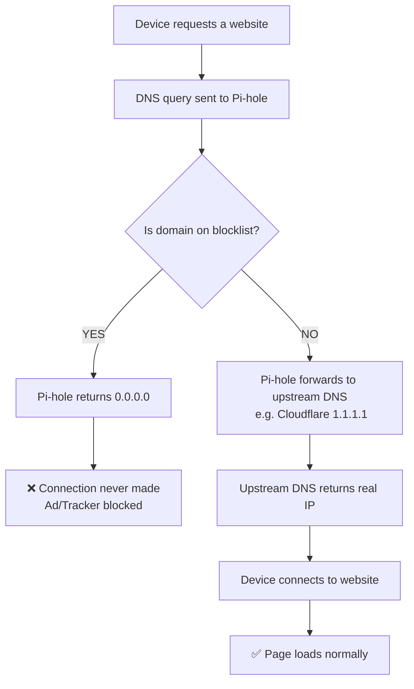

# Pi-hole

## What is it?
Pi-hole is a homemade DNS server using a Raspberry Pi as the server — in my 
case I went with the Raspberry Pi Zero 2 W. It is a great way to add an extra 
layer of protection against malware and trackers, while also blocking ads.

---

## Why I decided to build it
Besides it being a great beginner project, I wanted to improve my home network 
security and as a bonus get a break from all the exhausting ads on every 
tech device with a screen.

---

## How it works
It works by replacing my ISP's DNS server. A DNS server is like the internet's 
phone book — when accessing a website, the machine requests the IP address in 
number format from the DNS server, which replies, and then the machine makes 
the connection. Pi-hole acts as a filter, comparing the requested address 
against lists of known ad/tracker domains. If found in the list, Pi-hole 
replies with a null IP (0.0.0.0).

---

## Setup
It was a bit of a struggle to set up, even after watching tutorial videos. 
The issues I ran into:

1. **My ISP router/modem limitations** — My ISP's router doesn't allow much 
   configuration in order to prevent everyday users from changing things they 
   don't understand. To work around that I had to get my own router that allows 
   full configuration changes and use my ISP's device as a modem only.

2. **Internet speed throttling** — When I ran the Pi for the first time, my 
   internet speed dropped from 800 Mbps to 50 Mbps. AI suggested that since 
   the Pi was connected via Wi-Fi, it was limited by Wi-Fi speeds, and advised 
   me to buy a micro USB to RJ45 (ethernet) adapter to connect it directly to 
   the router.

3. **The AI "solution"** — After connecting via ethernet the same issue 
   persisted, though not for devices on Wi-Fi. AI suggested devices weren't 
   using Pi-hole as their DNS server. Finding that odd, I decided to poke 
   around the configurations myself.

**The actual fix:** My router wasn't telling devices where the DNS server was 
when assigning IPs via DHCP. After entering my Pi's IP address in the DHCP 
DNS settings, everything worked on all devices instantly.

---

## Lessons learned
The second most important lesson was not to be overreliant on AIs — it was 
spouting nonsense after a while and led me astray from a simple solution. 
The most important lesson was to trust my own knowledge and capabilities more.

---

## Network Diagram
![Network Diagram] (network_diagram.png)

---

## Flow Diagram

