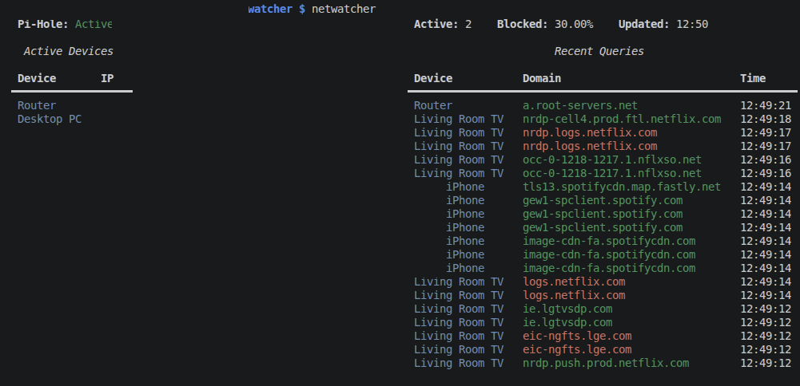
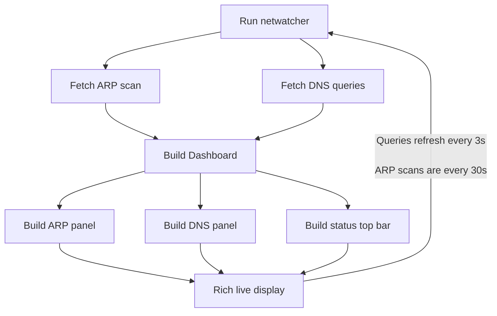

# Net-Watcher

Live TUI dashboard with active devices and recent queries from my Pi-hole



## Prerequisites

- A Pi-hole set up as your DNS server with version v6+
- Arp-scan installed on your Pi
- Python 3.11+ with rich library
- Git installed on Pi
- sqlite3 installed on Pi

## How it works

The dashboard has two panels. The DNS panel queries Pi-hole's FTL SQLite database directly - simpler than the REST API and more than enough for this use case. The ARP panel runs `arp-scan` via Python's `subprocess` library to detect active devices on the LAN. Both collectors required permission tweaks to run without sudo (see Setup).

## Setup

### Step 1: Clone the repo to your Pi
### Step 2: Create a `config.py`
Follow the same pattern as the `config.example.py` and map your devices there. 
It is recommended that you assign them a static IP
### Step 3: Check the config variables in `arp_scan.py`
- ARP_SCAN_BIN
- OUI_FILE
- MAC_VENDOR_FILE

They might have different paths
### Step 4: Add your user to Pi-hole's group
```bash 
sudo usermod -aG pihole $USER
```
Re-login into your Pi or reboot it for changes to take effect, verify your groups to confirm the changes

### Step 5: Grant cap_net_raw capability to arp-scan
```bash 
sudo setcap cap_net_raw+ep /usr/sbin/arp-scan
```
You can verify by running 
```bash 
arp-scan --localnet
``` 
(no sudo needed)

**This process needs to be redone after any `apt upgrade`**

### Step 6: Run with `python3 -m netwatcher` from the project root
The `-m` flag tells it to run in module mode, it is needed. Running with simply `python3 netwatcher.py` won't work due to the imports.

## Architecture


## Lessons Learned

My first wall in this project was permissions - for both DNS and ARP.

For DNS, I had to add my user to Pi-hole's group to be able to query the FTL database, even in `readonly` mode. The database file isn't world-readable, so without group membership I couldn't interact with it at all.

For ARP, `arp-scan` needs raw socket access which normally requires `sudo`. Rather than running the whole script as root, I used `setcap` to grant only the `cap_net_raw` capability to the `arp-scan` binary - the minimum privilege needed. This also solved a secondary issue: under `sudo`, `arp-scan` would drop privileges after opening the raw socket, and the dropped user couldn't traverse the filesystem to read the vendor files. I discovered this by using `strace` to trace the actual system calls and seeing it fail on a relative path lookup. With `setcap`, `arp-scan` runs as my normal user the entire time, so vendor files load correctly without needing explicit path flags.

I also learned that some of my devices keep sending telemetry and other communications sporadically, even when "turned off."